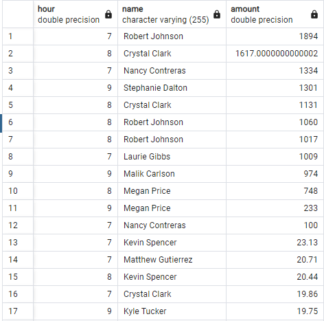

# Challenge_7_SQL

## Jupyter Lab Solutions
[Visual_Data_Analysis.ipynb](Starter_Files/visual_data_analysis.ipynb)

[Challenge.ipynb](Starter_Files/challenge.ipynb)

[Create_Tables.sql](Starter_Files/create_tables.sql)


# Data Analysis
## Part 1:
The CFO of your firm has requested a report to help analyze potential fraudulent transactions. Using your newly created database, generate queries that will discover the information needed to answer the following questions, then use your repository's ReadME file to create a markdown report you can share with the CFO:

Some fraudsters hack a credit card by making several small transactions (generally less than $2.00), which are typically ignored by cardholders.

**How can you isolate (or group) the transactions of each cardholder?**

> Count the transactions that are less than $2.00 per cardholder using SQL.

```
    SELECT ch.id,
    COUNT(t.id)
    FROM transaction as t
    JOIN credit_card AS cc on cc.card = t.card
    JOIN card_holder AS ch ON ch.id = cc.cardholder_id
    WHERE t.amount < 2
    GROUP BY ch.id
    ORDER BY count desc
```
    
> This can help you track those frequently purchasing under that threshold.


**Is there any evidence to suggest that a credit card has been hacked? Explain your rationale.**

> I would say, from a data standpoint, it's entirely possible that a card has been compromised.  Potentially this has to do with the data but it is highly unlikely that this many people are frequently having several hundred or thousand dollar meals at food trucks or coffee shops.

Take your investigation a step further by considering the time period in which potentially fraudulent transactions are made.

**What are the top 100 highest transactions made between 7:00 am and 9:00 am?**

```
    SELECT date_part('hour', t.date) AS hour, 
    ch.name,
    t.amount
    FROM transaction AS t
    JOIN credit_card AS cc ON cc.card = t.card
    JOIN card_holder AS ch ON ch.id = cc.cardholder_id
    AND date_part('hour', t.date) >= 7
    AND date_part('hour', t.date) <= 9
    ORDER BY t.amount desc
    LIMIT 100
```

**Do you see any anomalous transactions that could be fraudulent?**

> I would challenge any of these transactions over the ~20 range



**Is there a higher number of fraudulent transactions made during this time frame versus the rest of the day?**

> There is a significant amount of the "large" transactions occuring during this time frame.

**If you answered yes to the previous question, explain why you think there might be fraudulent transactions during this time frame.**

> I think it could be a number of factors, potentially during the 'busiest' part of the morning when someone is less likely to focus on their personal finances. Giving bad actors more time to react and take advantage of compromised finances.

**What are the top 5 merchants prone to being hacked using small transactions?**
Create a view for each of your queries.

> It would appear that restaurants, pubs, and foodtrucks have the most # of transactions under $2.

```SELECT 	mc.name,
    count(mc.name)
    FROM transaction AS t
    JOIN credit_card AS cc ON cc.card = t.card
    JOIN card_holder AS ch ON ch.id = cc.cardholder_id
    JOIN merchant AS m ON m.id = t.id_merchant
    JOIN merchant_category AS mc on mc.id = m.id_merchant_category
    WHERE t.amount < 2
    GROUP BY mc.name
    LIMIT 100
```


## Part 2
Your CFO has also requested detailed trends data on specific card holders. Use the starter notebook to query your database and generate visualizations that supply the requested information as follows, then add your visualizations and observations to your markdown report:

The two most important customers of the firm may have been hacked. Verify if there are any fraudulent transactions in their history. For privacy reasons, you only know that their cardholder IDs are 2 and 18.

**Using hvPlot, create a line plot representing the time series of transactions over the course of the year for each cardholder separately.**


**Next, to better compare their patterns, create a single line plot that contains both card holders' trend data.**


**What difference do you observe between the consumption patterns? Does the difference suggest a fraudulent transaction? Explain your rationale.**

>Looking at the consumption patterns of #18 in particular, I would say there are certainly instances of suspicious activity.  Without context and assuming that #18 is not hosting dinner parties regularly I would say multiple >$1000 restaurant transactions would be unusual.  Particularly, the food truck transaction on 11/17/2018 for $1,769 stands out.  
   
>As for #2 their purchase pattern never really stepped out of the usual bounds.  I would invest more effort into reviewing #18 further.


The CEO of the biggest customer of the firm suspects that someone has used her corporate credit card without authorization in the first quarter of 2018 to pay quite expensive restaurant bills. Again, for privacy reasons, you know only that the cardholder ID in question is 25.

**Using hvPlot, create a box plot, representing the expenditure data from January 2018 to June 2018 for cardholder ID 25.**


**Are there any outliers for cardholder ID 25? How many outliers are there per month?**
    
> You can identify several outliers to the normal small transaction amounts carried out by #25.  For instance, there were 3 instances in April & June alone.  These are quite significant when compared to the average amounts of less than $20.

**Do you notice any anomalies? Describe your observations and conclusions.**

> In all of the instances that the amounts were > $200 you could see them spending significant sums of money at places like food trucks and coffee shops.  These seem uncharacteristic of the locations.


## Challenge
Another approach to identifying fraudulent transactions is to look for outliers in the data. Standard deviation or quartiles are often used to detect outliers.

Use the challenge starter notebook to code two Python functions:

**One that uses standard deviation to identify anomalies for any cardholder.**

```
random = np.random.randint(1,25,3)

for id in random:
    if len(outlier(id)) == 0:
        print(f"Found cardholder {id} had no outliers.")
    else:
        print(f"Found cardholder {id} had the following outliers:\n{outliers(id)}.")
```

**Another that uses interquartile range to identify anomalies for any cardholder.**

> I was not able to figure this one out in time for turn-in.