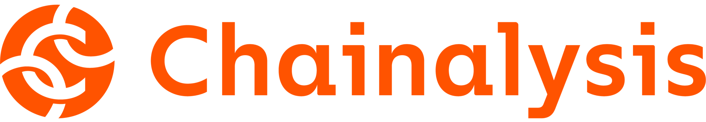

## Module1CaseStudy_RegTech

## Overview and Origin of Chainalysis

> Chainalysis, headquartered in New York City, was founded in 2014

> The company was originally formed in order to investigate the Mt. Gox cryptocurrency exchange hack and has continued to be used as a way to track crypto currency fraud

> It would seem that Chanalysis acquires funding through a number of Series F finacing.  As recently as May 12,2022 they received 170 million in financing.  Resulting in a valuation of [$8.6 Billion](https://blog.chainalysis.com/reports/series-f/#:~:text=NEW%20YORK%2C%20May%2012%2C%202022,its%20valuation%20to%20%248.6%20billion)

    

## Business Activities

> This company is aiming to close the gap in blockchain analytics.  They are currently one of the most heavily funded regulation and compliance service companies in the market.

> They provide solutions for government agencies, exchanges, financial instituions, insurance, and cybersecurity companies in over 70 countries. 

[Source: Chainalysis](https://www.chainalysis.com/company/)

>> Some noteable companies include **Barclays**, **Square**, and **Gemini**

> They support a range of organizations from cryptocurrency exchanges to the United States Department of Justice

> Some of their proprietary tools include: 

- Know Your Transactions 'KYT'
    > Real-time API to reduce manual workflows, remain compliant with regulations, and allow for safe interactions with DeFi and other emerging technology

- Storyline
    > Easily review contracts, NFTs, protocols, with a focus on Web3

- Reactor
    > Connects cryptocurrency transactions to real-world entities, examines criminial activity, event NFT transfers

[Source: Chainalysis Product List](https://www.chainalysis.com/chainalysis-data/)

> The primary offerings revolve around blockchain technologies.  They are some of the pioneers in Web3 analytics.  Managing to scrape and gather an enormous amount of data for their clients which has been a key driver in their success.

## Landscape

> Chainalysis sits firmly in the RegTech industry

> One of the majory trends of this domain is the consolidation of regulatory practices.  As blockchain technologies continue to grow and develop these RegTech companies are finding opportunities to help government agencies and companies navigate the murky waters of the new web.

> Some other majory companies in RegTech include:
- [Tessian](https://www.tessian.com/)
 
    >London, UK based company, aimed to reduce compliance risks with human error on email 

- [Ascent](https://www.ascentregtech.com/)

    >Chicago, IL company, focused on financial compliance software.  

- [PaymentWorks](https://www.paymentworks.com/)

    >Waltham, MA company, focused on fraud detection for B2B payments.

## Results

> Some of the most noteable and newsworthy accomplishments of Chainalysis, so far, include investigating child abuse material, darknet markets like Silk-Road, at least 7 North Korean hackings, among others.

> From research, it would seem that these companies view their success based on funding and results.  Results in the form of government actions based on their investigations, retrieval of stolen crypto assets, continued work in the regulatory and compliance space.
    >> Additionally, the several billions in valuation certainly help lend to their success

> Comparatively, Chainalysis appears to be the leader in this space, working with the largest number of government agencies, being involved in some of, if not the, biggest landmark cases in the darkweb and randsomware attacks.

## Recommendations
    
> One recommendation for Chainalysis continued success would be to more aggressively work towards marketing their products at maintstreet banks.  As the large banks continue to explore crypto and NFT options they will need a regulatory partner in this space.  There could be room to grow even further.

> From within my own bank, the conversations around cryptocurrencies are becoming more frequent by the day.  The understanding in this space is extremely limited and has a lot of potential for misstep.  It would make sense for one of the pioneers in fraud/investigative solutions to get involved in helping these large firms setup approriate safeguards to ensure their clients and businesses are protected from bad actors.

> Their custom APIs allow for easy deployment of their compliance and regulatory tools to new customers.  This will allow for the saving of time and money from Chainalysis perspective and potential revenue streams in addition to their continued Series financing.

## Additional Sources
- [List of RegTech Businesses](https://www.blockdata.tech/markets/industries/regtech)
- [FinTech Global RegTech 100 2023](https://fintech.global/regtech100/)
- [Bloomberg Artile on Chainalysis](https://www.bloomberg.com/news/articles/2022-09-21/crypto-tracer-chainalysis-busts-bitcoin-btc-anonymity)
    > "The $8.6 Billion Startup That Helps Governments Trace Crypto"
- [Forbes on Chainalysis](https://www.forbes.com/companies/chainalysis/?sh=368110e15e3b)
- [Coindesk References to Chainalysis](https://www.coindesk.com/tag/chainalysis/)